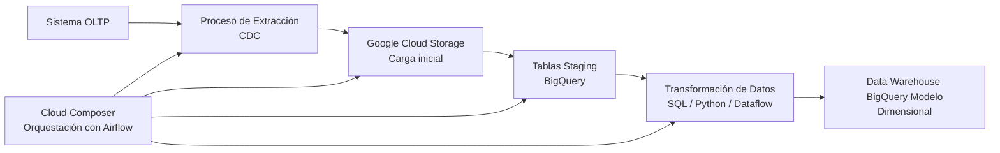

# credit-analytic-project-challenge

## Descripción del proyecto

Proyecto que tiene como objetivo diseñar un modelo analítico de datos que permita analizar los créditos otorgados a PYMES. Se diseña un **modelo dimensinal tipo Data Warehous**e para analizar el desempeño de los creditos otorgados, mediante **consultas SQL y un pipe line conceptual**, aplicando principios de modelados de datos, una arquitectura analitica y calidad de datos.

---

Las 2 fuentes de datos utilizadas son las siguientes:

## Tabla: Créditos

| Campo            | Descripción                                        |
| ---------------- | -------------------------------------------------- |
| credit_id        | Identificador del crédito                          |
| customer_id      | Identificador del cliente                          |
| origination_date | Fecha de originación del crédito                   |
| amount           | Monto otorgado                                     |
| term_months      | Plazo del crédito                                  |
| interest_rate    | Tasa de interés                                    |
| status           | Estado del crédito (active, late, default, closed) |


## Tabla: Pagos

| Campo        | Descripción                             |
| ------------ | --------------------------------------- |
| payment_id   | Identificador del pago                  |
| credit_id    | Identificador de crédito asociado       |
| payment_date | Fecha del pago                          |
| amount_paid  | Monto pagado                            |
| days_late    | Días de atraso                          |

---

# Objetivos

Construir un pequeño modelo analítico que permita responder:

* ¿Cuál es el monto total colocado por mes?
* ¿Cuál es la tasa de mora (créditos con días_late > 30)?
* ¿Cuál es el ingreso estimado por intereses por cohorte de originación?
* ¿Cuál es el % de default por mes de originación?


## Modelado de Datos

Se propone un **modelo dimensional tipo estrella**.


## Tabla de hechos principal

### fact_paymenst

| Columna         | Descripción                 |
| --------------- | --------------------------- |
| payment_id      | identificador del pago      |
| credit_id       | identificador del crédito   |
| customer_id     | identificador del cliente   |
| payment_type_id | identificadore tipo de pago |
| payment_date    | fecha del pago              |
| amount_paid     | monto pagado                |
| days_late       | días de atraso              |

---

## Dimensiones

Se poponen las siguiente dimensiones

### dim_credit

| columna          | Descripción                |
| ---------------- | -------------------------- |
| credit_id        | Identificador del crédito  |
| product_id       | identificador del producto |
| origination_date | fecha de originación       |
| amount           | monto del crédito          |
| term_months      | plazo                      |
| interest_rate    | tasa                       |
| status_id        | estado del crédito         |

---

### dim_credit_status

| Campo           | Descripción                                |
| --------------- | ------------------------------------------ |
| status_id       | identificador del estado                   |
| status          | estatus (active, late, default, closed)    |
| status_desc     | descripcion del estatus                    |

---

### dim_customer

| Columna           | Descripción                    |
| ----------------- | ------------------------------ |
| customer_id       | identificador del cliente      |
| customer_name     | nombre del cliente             |
| customer_type     | tipo de cliente (segmentacion) |

---

### dim_payment_type

| Columna         | Descripción                |
| --------------- | -------------------------- |
| payment_type_id | identificador tipo de pago |
| payment_type    | tipo de pago               |
| channel         | canal de pago              |

---

### dim_product

| Columna         | Descripción                     |
| --------------- | ------------------------------- |
| product_id      | identificador del producto      |
| product_name    | nombre del producto             |
| product_type    | tipo de crédito                 |
| max_term_months | plazo máximo                    |


## ¿Por qué modelo estrella?

Se eligió modelo estrella porque:

* Simplifica consultas analíticas
* Reduce joins complejos
* Mejores tiempos de consulta en BI
* Es el estándar en Data Warehouses analíticos

---

## SQL

### Monto total colocado por mes 

```sql
SELECT DISTINCT
    TO_CHAR(origination_date, 'Month') AS mes,
    SUM(amount) OVER (PARTITION BY TO_CHAR(origination_date, 'Month')) AS total_colocado
FROM dim_credit
ORDER BY 1
;
```

### Tasa de mora (creditos con días_late > 30)

```sql
SELECT
    COUNT(DISTINCT CASE WHEN days_late > 30 THEN credit_id END) /
    COUNT(DISTINCT credit_id) * 100 AS "TASA_MORA_>30"
FROM fact_payments
;
```

### Ingreso estimado por interes

```sql
SELECT
    TO_CHAR(origination_date, 'Month') AS mes,
    SUM(amount * (interest_rate/100) * (term_months/12)) AS intereses_estimados
FROM dim_credit
WHERE TO_CHAR(origination_date, 'YYYY') = '2022'
GROUP BY TO_CHAR(origination_date, 'Month')
ORDER BY 1
;
```

### % Default por mes de originación

```sql
SELECT DISTINCT
    TO_CHAR(origination_date, 'Month') AS mes,
    SUM(interest_rate) OVER (PARTITION BY TO_CHAR(origination_date, 'Month')) AS total_colocado
FROM dim_credit
ORDER BY 1
;
```

**Nota**: Para la myoria de los casos se agregarion mas query's y se agregaron otras 2 validaciones que considere oportunas

---

## Pipeline conceptual




### Explicación del diagrama

* **OLTP Database** → sistema transaccional de origen.
* **Extraction Process** → proceso que extrae los datos del OLTP.
* **Cloud Storage** → capa de landing o raw data.
* **BigQuery Staging** → tablas temporales para preparar los datos.
* **Transformations** → limpieza y transformación de datos.
* **BigQuery Data Warehouse** → modelo dimensional final (hechos y dimensiones).
* **Cloud Composer (Airflow)** → orquesta todo el pipeline.

---

# Calidad de datos

La calidad de datos se valida en la mayoria etapas del proceso ETL/ELT, para ello se implementan controles basados las dimensiones de calidad.
Se proponen algunos ejemplos puntuales:

### 1. Precisión (Accuracy)

La precisión asegura que los datos reflejen correctamente la realidad del negocio.

Ejemplos de validacion:

* Verificar que el monto de pago (`payment_amount`) coincida con el valor registrado.
* Validar que los días de atraso (`days_late`) correspondan correctamente a la diferencia entre la fecha de pago y la fecha de vencimiento.

### 2. Validez

Garantiza que los datos cumplan con formatos y reglas de negocio definidas.

Ejemplos de validacion:

* Validar que `payment_amount` sea mayor que 0.
* Verificar que las fechas (`payment_date`) tengan un formato válido y no sean futuras.
* Confirmar que `days_late` no tenga valores negativos.

### 3. Completitud (Integridad)

Asegura que todos los datos necesarios estén presentes y sin valores faltantes en campos críticos.

Ejemplos de validacion:

* Verificar que campos clave como `credit_id`, `customer_id` y `payment_date` no contengan valores nulos.
* Validar que cada credito tenga al menos un registro en la tabla de pagos cuando corresponda.
* Controlar que todos los registros esperados del dia se hayan cargado correctamente.

### 4. Consistencia

Asegura que los datos sean coherentes entre diferentes tablas o sistemas.

Ejemplos de validacion:

* Confirmar que todos los `credit_id` exixstentes en <mark>fact_payments</mark> existan en <mark>dim_credit</mark>.
* Comparar totales entre tablas de staging y tablas finales para detectar discrepancias.

### 5. Unicidad

Verificar que no existan registros duplicados que afecten el analisis.

Ejemplos de validacion:

* Verificar que la combinación `credit_id` + `payment_date` + `amount_paid` sea unica en la tabla fact_payments.
* Implementar controles que detecten duplicados durante la carga incremental.

### 6. Puntualidad (Actualidad)

Asegura que los datos estén disponibles y actualizados en el momento necesario para su analisis.

Ejemplos de validacion:

* Verificar que el pipeline se ejecute diariamente según el calendario programado.
* Validar que los datos cargados correspondan al periodo esperado (por ejemplo, pagos del dia anterior o el famoso T-1).
* Generar algun alertas cuando la carga no se complete dentro del tiempo esperado.
